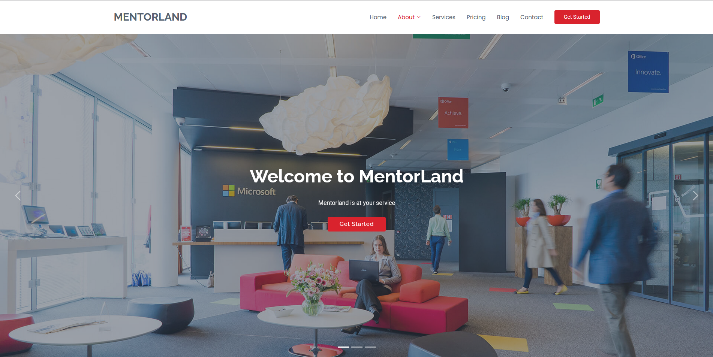
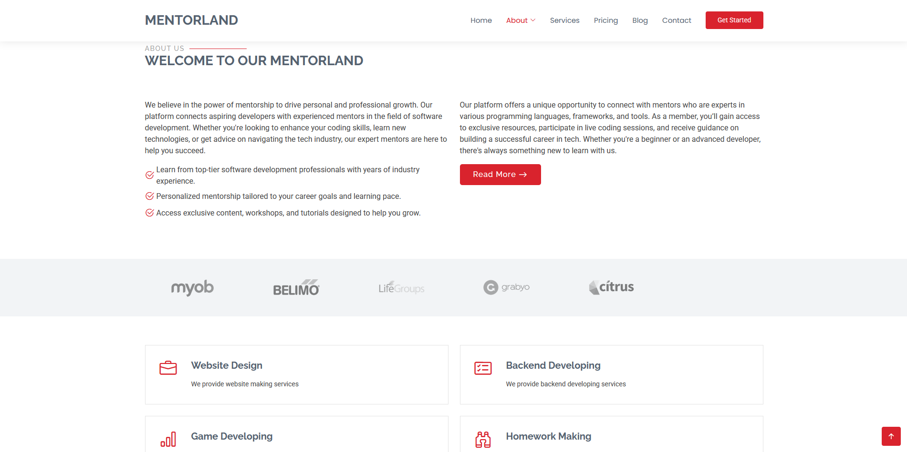
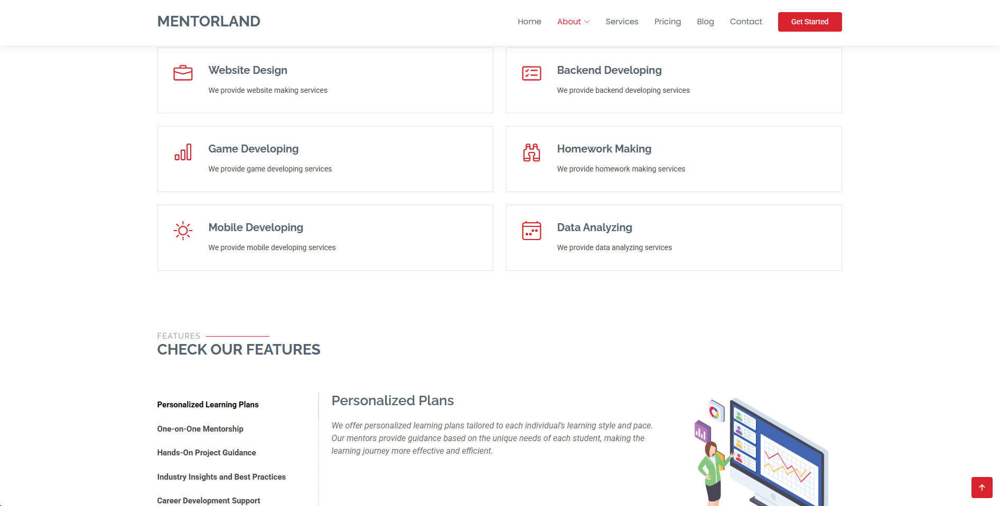
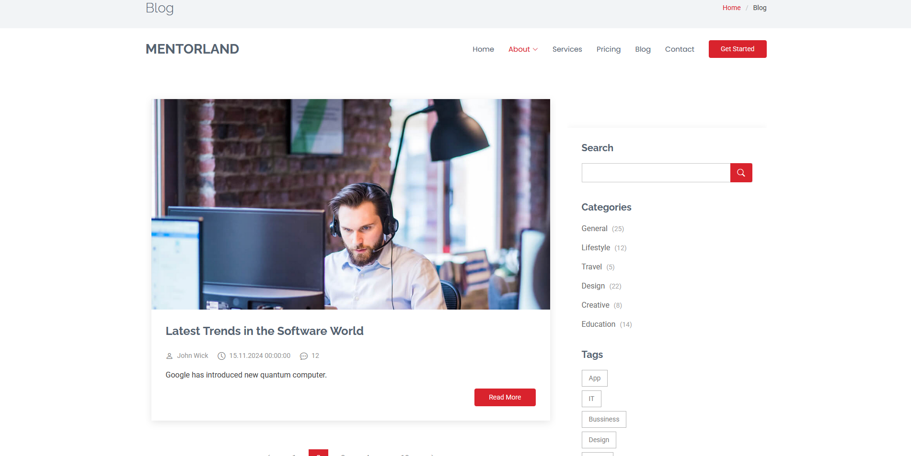
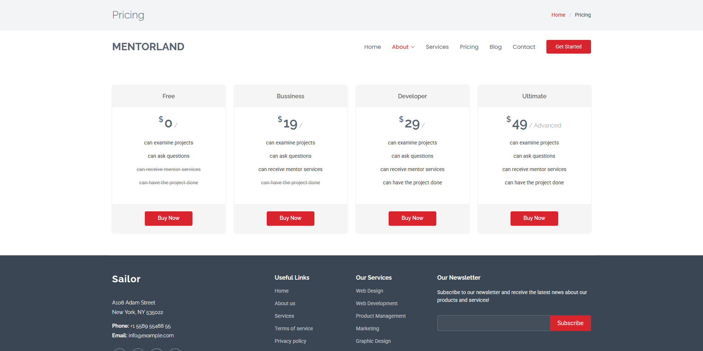
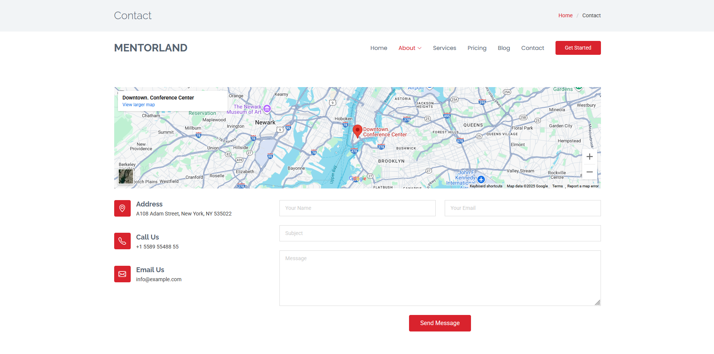

# 🧠 Developer Mentorship Platform — Software Consulting Simulation

<br>

[](../../issues/new?labels=bug)
[](../../issues/new?labels=enhancement)

<br>

## 📌 Project Overview

**Developer Mentorship Platform** is a simulation of a company that provides **software consulting and mentorship services** through an online platform.  
Mentors can register on the site to offer guidance, while users can reach out for **software development support** and **career mentoring**.  

<br>

## ✨ Features

- 👤 **User Management** — Membership system for both mentors and mentees  
- 💬 **Software Consulting** — Users can connect with mentors for development help and career advice  
- 🧱 **Layered Architecture** — Built with n-tier architecture for scalability and maintainability  
- 🗄️ **Database Design** — Well-structured relational design ensuring consistency and performance  
- 🧠 **Repository Pattern + DI** — Repository abstraction and dependency injection for clean, testable code

<br>


## 🖼️ Screenshots
## 🖼️ Screenshots
Shown below in order:  
**1. Landing 1** · **2. Landing 2** · **3. Services**<br>
**4. Blog** · **5. Pricing & Footer** · **6. Contact**

<p align="center">
  
  
  
</p>

<p align="center">
  
  
  
</p>

<br>

## 🧰 Tech Stack

<p>
  
  
  
  
  
  
</p>


<br>

## 📥 Installation

### Prerequisites
- .NET SDK 7.0+  
- Microsoft SQL Server

### Setup
```bash
git clone [repository-url]
cd developer-mentorship-platform

dotnet restore
dotnet ef database update   # Apply migrations
dotnet run
```

Then open the application in your browser.  
Mentors and users can register, and consulting features can be tested through the UI and API.

<br>

## 📜 License

[](LICENSE)

This project is licensed under the terms described in the [LICENSE](./LICENSE) file.

---

© 2025 Yusuf Okan Sirkeci — [Hereetria](https://github.com/Hereetria)
